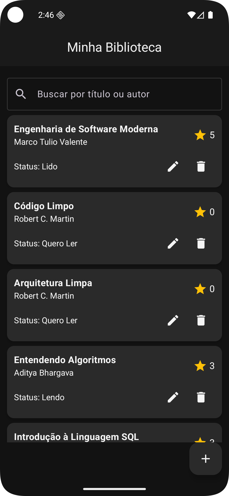
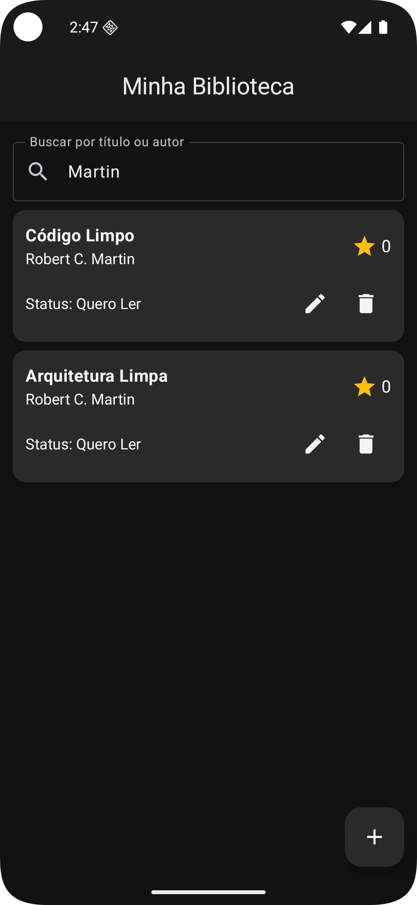
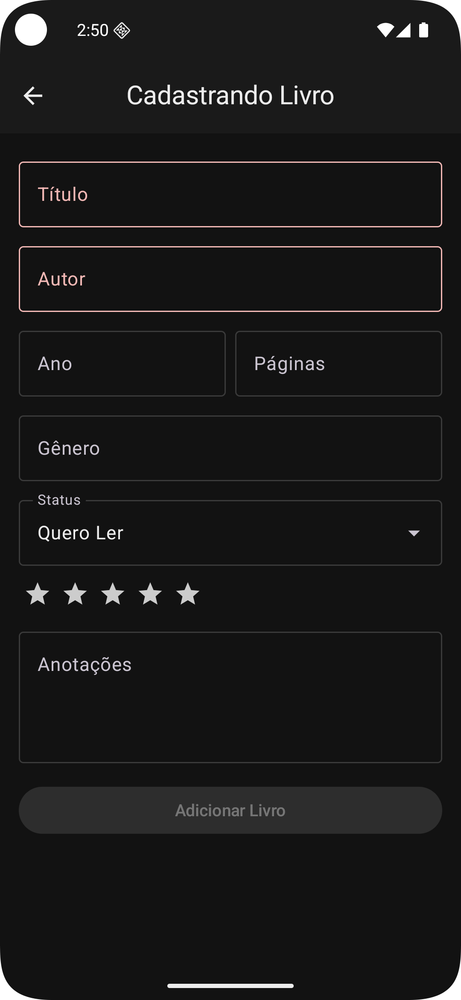
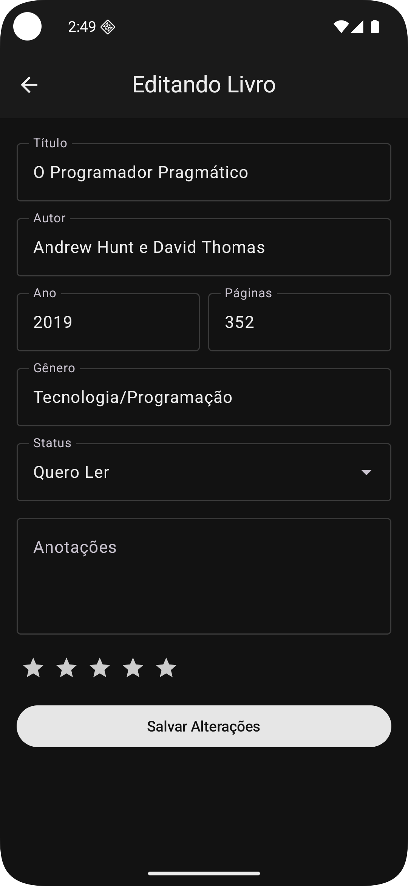
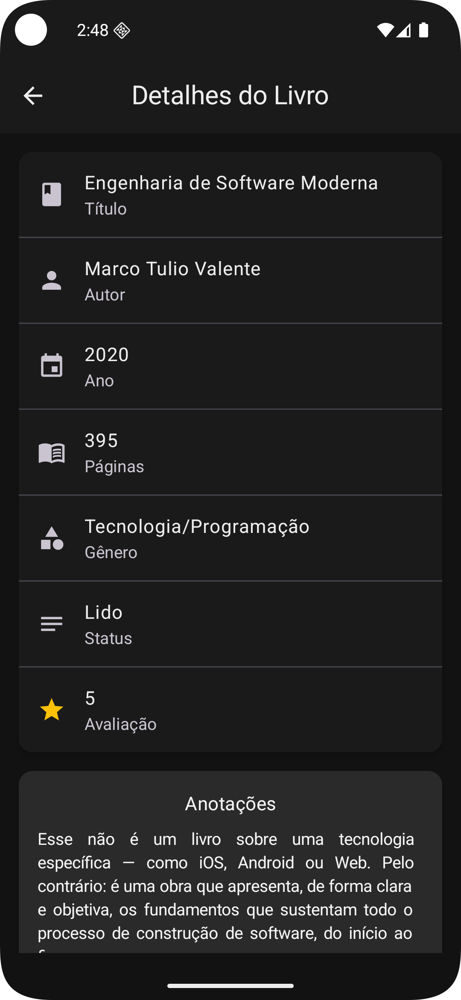

# 📚 MyLibrary

Aplicativo Android para gerenciamento de biblioteca pessoal, desenvolvido como projeto da disciplina de Desenvolvimento de Aplicativos Android.

## 🖼️ Screenshots
<p align="center">
  
  
  
  
  
</p>

## 📱 Sobre o Projeto

MyLibrary é um aplicativo que permite aos usuários catalogar e gerenciar sua coleção pessoal de livros. Você pode adicionar livros, acompanhar seu progresso de leitura, fazer anotações e avaliar suas leituras.

## ✨ Funcionalidades
  - Adicionar novos livros à biblioteca
  - Visualizar detalhes completos de cada livro
  - Editar informações dos livros cadastrados
  - Remover livros da biblioteca
  - Buscar livros por título ou autor
  - Gerenciar status de leitura: "Quero Ler", "Lendo" e "Lido"
  - Sistema de avaliação com estrelas (0-5)
  - Campo de anotações para cada livro

- 💾 **Persistência de Dados**
  - Armazenamento local usando SharedPreferences
  - Dados preservados entre sessões do aplicativo

## 🛠️ Tecnologias Utilizadas

- **Kotlin** - Linguagem de programação
- **Jetpack Compose** - Framework de UI declarativa
- **Android Architecture Components**
  - ViewModel - Gerenciamento de estado e lógica de negócio
  - StateFlow - Observação reativa de dados
  - Lifecycle - Gerenciamento do ciclo de vida
  - Navigation Compose - Navegação entre telas com rotas tipadas
- **Material Design 3** - Componentes e design system
- **SharedPreferences** - Persistência local de dados
- **Gson** - Serialização/deserialização de objetos JSON
- **Coroutines** - Programação assíncrona

## 🚀 Como Executar

### Pré-requisitos
- Android Studio Hedgehog | 2023.1.1 ou superior
- JDK 11 ou superior
- SDK Android API 24 (Android 7.0) ou superior

### Passos

1. Clone o repositório
```bash
git clone https://github.com/julianosgarbossa/MyLibrary.git
```

2. Abra o projeto no Android Studio

3. Aguarde a sincronização do Gradle

4. Execute o projeto em um emulador ou dispositivo físico

